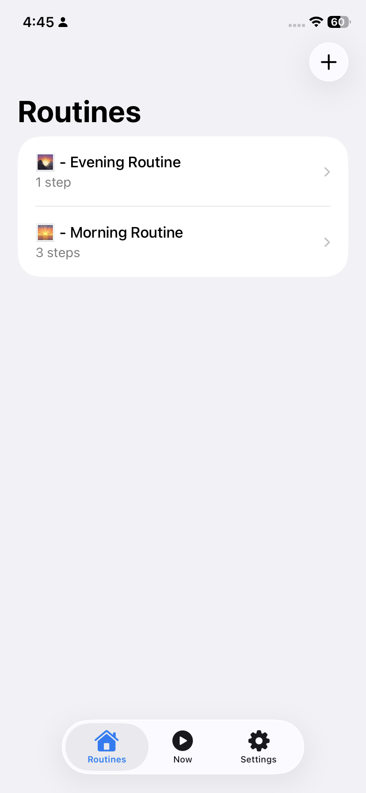
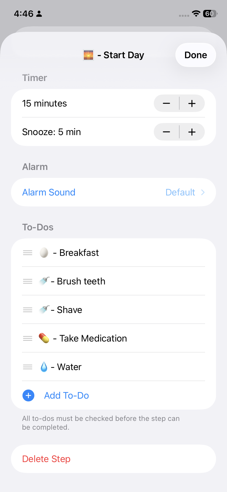
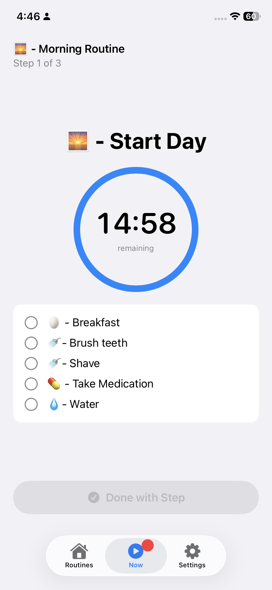
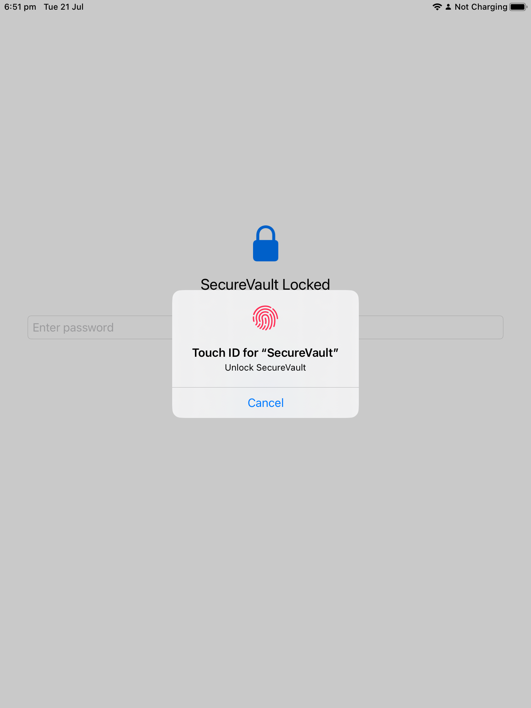
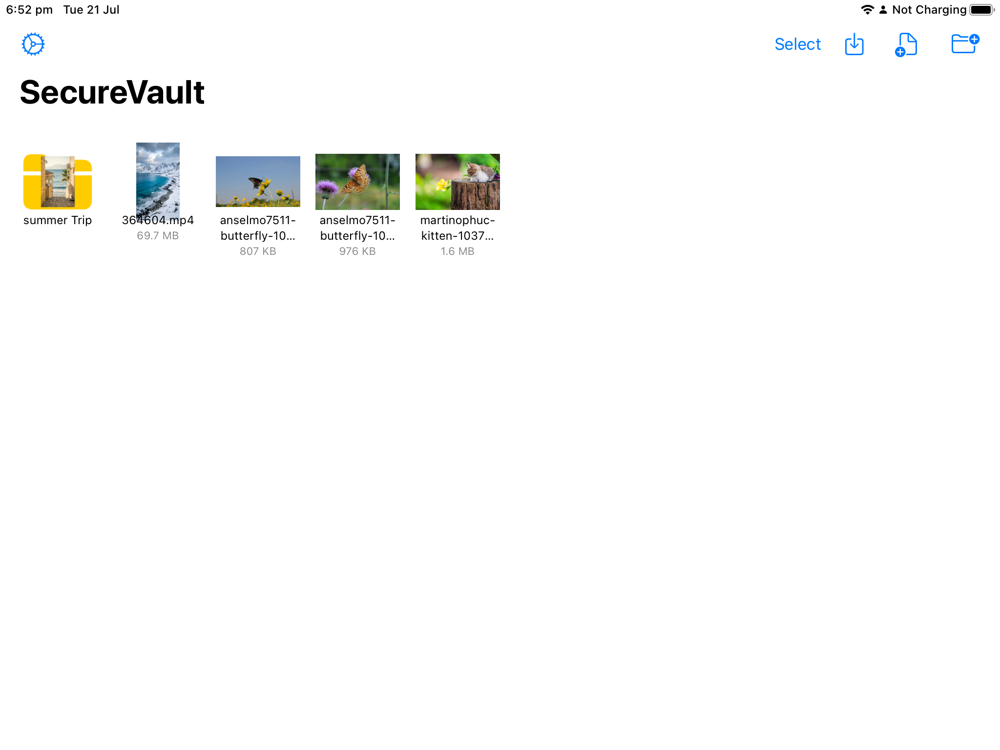
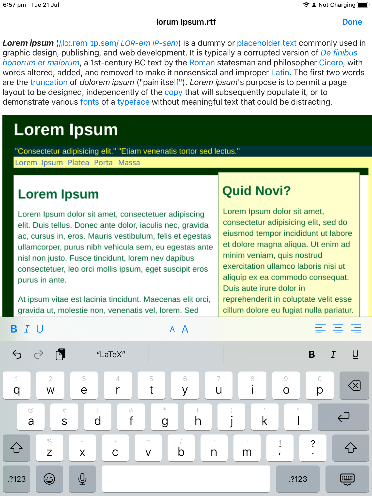

# Nick Johnson

**Engineer + Author + Designer + Silly Goose** — I like making things that users like using.

[GitHub](https://github.com/NyckJohnson) · [Email](mailto:nyck.johnson@gmail.com) · [Résumé](https://github.com/NyckJohnson/NyckJohnson/blob/main/Nicholas_Johnson_Resume.pdf)

---

## 01 — Alarming Routines
**iPhone · SwiftUI, Core Data, AppKit**

I have tried hundreds of routine apps and quickly ignored them once I finished. Timers and alarms simply get turned off because I am busy and focused on something else. I needed an alarm I couldn't blow off, only snooze. No one else had made that for me so I made my own.

[Source](https://github.com/NyckJohnson/RoutineBuilder-iOS)

<table>
    <tr>
        <td align="center">
        Main window 
        
    </td>
    <td align="center">
        Morning routine 
        
    </td>
    <td align="center">
        Running routine 
        
    </td>
    </tr>
</table>

---

## 02 — Secure Vault
**iPhone · SwiftUI, Core Data, AppKit**

An encrypted file storage vault. Other apps expected a subscription for a UI so poorly implemented they are near unusable. Getting that UI to work right in all the edge cases did take a couple weeks for me but I'm pretty happy with the results.

[Source](https://github.com/NyckJohnson/Secure-Vault)

<table>
<tr>
<td align="center">
Lock screen 

</td>
<td align="center">
    Files view 

</td>
<td align="center">
Image viewer 

</td>
<td align="center">
    Text viewer 

</td>
</tr>
</table>
